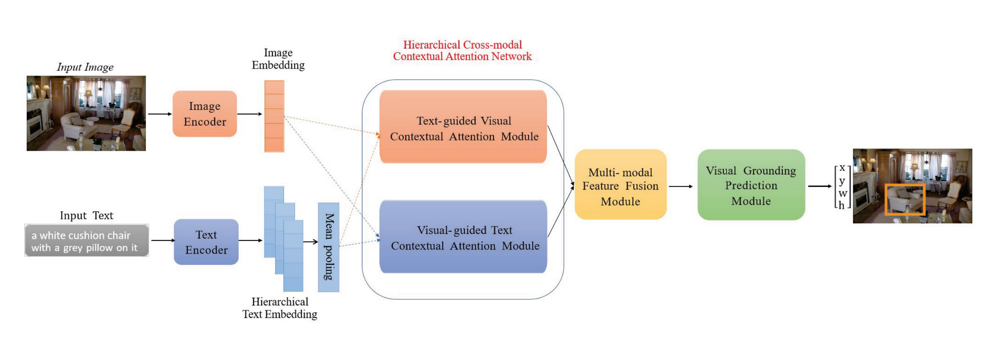

# HCCAN
<p align="center">  </p>

This is an implementation of HCCAN.

    

### Installation
Clone this repository.
    ```
    git clone https://github.com/cutexin66/HCCAN
    ```


### Getting Started

Please refer to [GETTING_STARGTED.md](docs/GETTING_STARTED.md) to learn how to prepare the datasets and pretrained checkpoints.

### Pre_trained Model 

The models with ResNet-50 backbone is available in [[Gdrive]](https://drive.google.com/drive/folders/1kj-ySKSjUHfBKUywmkS8tkbXidbteOlz?usp=share_link)

<table border="2">
    <thead>
        <tr>
            <th colspan=1> </th>
            <th colspan=3> &nbsp&nbsp&nbsp&nbsp&nbsp&nbsp&nbsp RefCOCO </th>
            <th colspan=3> &nbsp&nbsp&nbsp&nbsp&nbsp&nbsp&nbsp RefCOCO+</th>
            <th colspan=3> &nbsp&nbsp&nbsp&nbsp&nbsp&nbsp&nbsp RefCOCOg</th>
            <th colspan=2> Flickr30k</th>
        </tr>
    </thead>
    <tbody>
    <tr>    
            <td> </td>
            <td>val</td>
            <td>testA</td>
            <td>testB</td>
            <td>val</td>
            <td>testA</td>
            <td>testB</td>
            <td>g-val</td>
            <td>u-val</td>
            <td>u-test</td>
            <td>test</td>
        </tr>
    </tbody>
    <tbody>
    <tr>
            <td> R-50 </td>
            <td>83.61</td>
            <td>86.66</td>
            <td>78.57</td>
            <td>69.90</td>
            <td>74.96</td>
            <td>59.33</td>
            <td>71.53</td>
            <td>71.49</td>
            <td>71.84</td>
            <td>79.47</td>            
        </tr>
    </tbody>
</table>


### Training and Evaluation

1.  Training
    ```
    CUDA_VISIBLE_DEVICES=0,1,2,3,4,5,6,7 python -m torch.distributed.launch --nproc_per_node=8 --use_env train.py --batch_size 8 --lr_bert 0.00001 --aug_crop --aug_scale --aug_translate --backbone resnet50 --detr_model ./checkpoints/detr-r50-unc.pth --bert_enc_num 12 --detr_enc_num 6 --dataset unc --max_query_len 20 --output_dir outputs/unc_r50 --epochs 90 --lr_drop 60
    ```

    We recommend to set --max_query_len 40 for RefCOCOg, and --max_query_len 20 for other datasets. 
    
    We recommend to set --epochs 180 (--lr_drop 120 acoordingly) for RefCOCO+, and --epochs 90 (--lr_drop 60 acoordingly) for other datasets. 

2.  Evaluation
    ```
    CUDA_VISIBLE_DEVICES=0,1,2,3,4,5,6,7 python -m torch.distributed.launch --nproc_per_node=8 --use_env eval.py --batch_size 8 --num_workers 4 --bert_enc_num 12 --detr_enc_num 6 --backbone resnet50 --dataset unc --max_query_len 20 --eval_set val --eval_model ./outputs/unc_r50/best_checkpoint.pth --output_dir ./outputs/unc_r50
    ```

### Acknowledge
This codebase is partially based on [TransVG](https://github.com/djiajunustc/TransVG) and [DETR](https://github.com/facebookresearch/detr).

### Correction
There is a small error about the batch size in the paper. The batch size can be adjusted according to your memory size, but if it is RTX3090, we recommend around 10.
