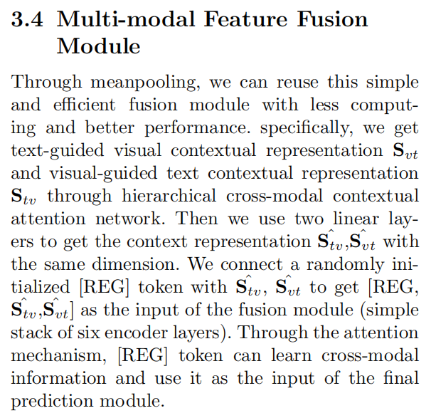
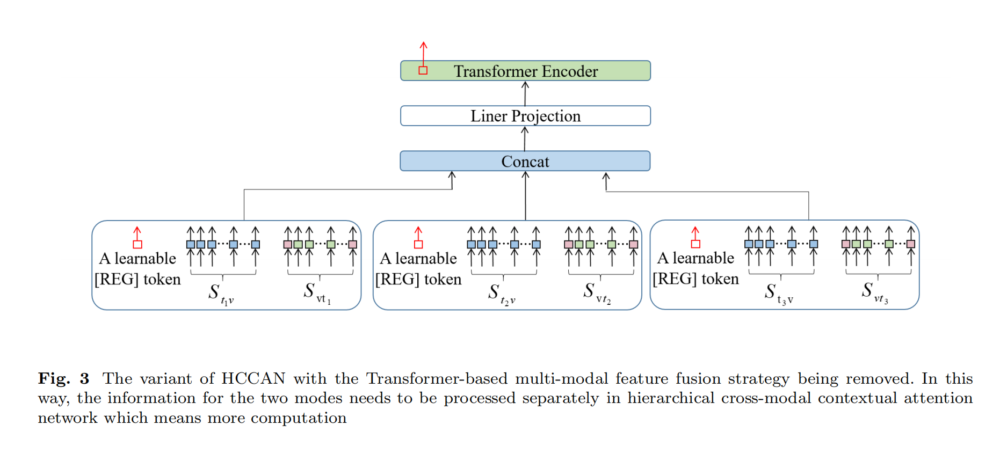
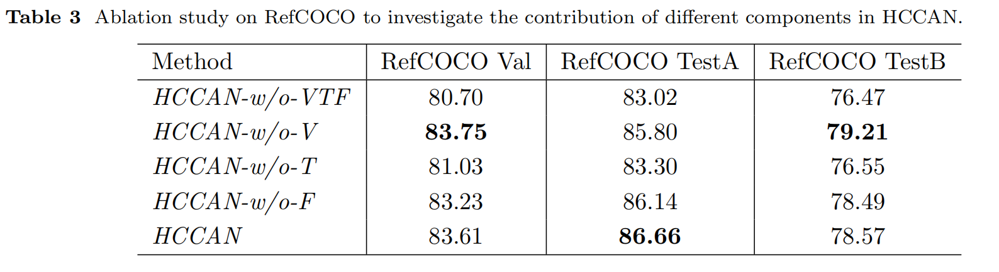

Thank you for your attention to my work, I am very sorry, because I did not do a good job of version control, I found some inconsistencies with my final version of the paper, these errors are mainly in the fusion strategy part of the ablation experiment, and I will make some corrections here

There is a small error about the batch size in the paper. The batch size can be adjusted according to your memory size, but if it is RTX3090, we recommend around 10.

The description of 3.4 is corrected to

  

Figure 3 is a variant of HCCAN, shown as follows

  

The corresponding ablation experimental data are as follows

  

Finally, we found a interesting phenomenon,HCCAN-w/o-V plays a more important role. We think the main reason why the text-guided visual attention module has a large difference in the results is that the encoder of the visual-guided text attention module is trained from scratch, while the weight of the text-guided visual attention module is determined by the weight of the pre-trained loaded detr, so it does not need to be trained from scratch. On the other hand, our visual guidance information is not multi-level.

